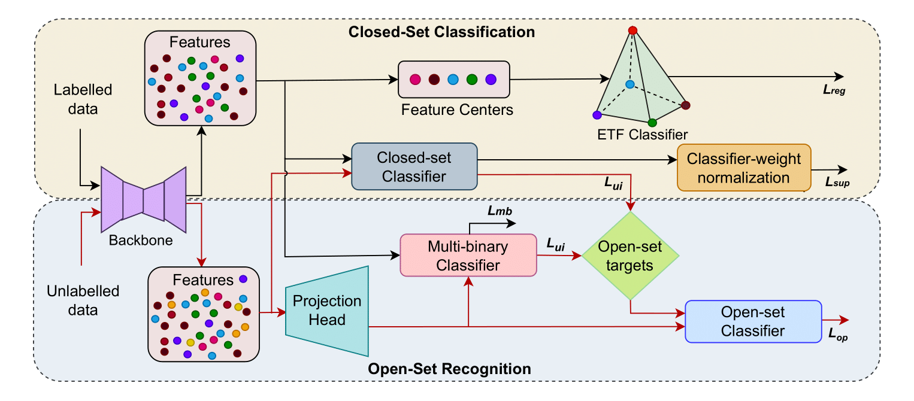

# Open-Set Semi-Supervised Learning for Long-Tailed Medical Datasets</br>
Daniya Najiha<sup>1</sup>, Jean Lahoud<sup>1</sup>, Mustansar Fiaz<sup>2</sup>, Amandeep Kumar<sup>3</sup>, Hisham Cholakkal<sup>1</sup></br>
Mohamed Bin Zayed University of Artificial Intelligence<sup>1</sup>, IBM Research<sup>2</sup>, Johns Hopkins University<sup>3</sup>

This is the official repository for our **ISBI 2025** paper.
[[`Paper`](https://arxiv.org/abs/2505.14846)]  [[`Models and Logs`](https://mbzuaiac-my.sharepoint.com/:f:/g/personal/daniya_kareem_mbzuai_ac_ae/EmBQ6O44QIdDgtbo4-iKHjwBJN3wsilaT1CDBtLplyMICQ?e=vikozC)]

<hr />
<p align="center">
  
</p>

> **Abstract:** *Many practical medical imaging scenarios include categories that are under-represented but still crucial. The relevance of image recognition models to real-world applications lies in their ability to generalize to these rare classes as well as unseen classes. Real-world generalization requires taking into account the various complexities that can be encountered in the real-world. First, training data is highly imbalanced, which may lead to model exhibiting bias toward the more frequently represented classes. Moreover, real-world data may contain unseen classes that need to be identified, and model performance is affected by the data scarcity. While medical image recognition has been extensively addressed in the literature, current methods do not take into account all the intricacies in the real-world scenarios. To this end, we propose an open-set learning method for highly imbalanced medical datasets using a semi-supervised approach. Understanding the adverse impact of long-tail distribution at the inherent model characteristics, we implement a regularization strategy at the feature level complemented by a classifier normalization technique. We conduct extensive experiments on the publicly available datasets, ISIC2018, ISIC2019, and TissueMNIST with various numbers of labelled samples. Our analysis shows that addressing the impact of long-tail data in classification significantly improves the overall performance of the network in terms of closed-set and open-set accuracies on all datasets.* 
<hr />

## Results
<p align="center">
  
</p>

## Preparation

### Required Packages

We suggest first creating a conda environment:

```sh
conda create --name openltr python=3.8
```

then use pip to install required packages:

```sh
pip install -r requirements.txt
```

### Datasets

Please put the datasets in the ``./data`` folder (or create soft links) as follows:
```
OpenLTR
├── config
    └── ...
├── data
    ├── ISIC2018
        └── ISIC2018_Dataset
             └── AK
             └── BCC
             └── ...
     ├── ISIC2019
        └── ISIC2019_Dataset
            └── ....
├── semilearn
    └── ...
└── ...  
```

For the train-test splits of ISIC2018, we follow [ECL](https://github.com/zylbuaa/ECL).


### Training

Here is an example to train OpenLTR on ISIC2018 with 25 % of data labels per seen class (*i.e.* with 1311 labeled samples in total). 

```sh
# seed = 1
CUDA_VISIBLE_DEVICES=0 python train.py --c config/openset_cv/openltr/isic2018.yaml
```

### Evaluation

After training, the best checkpoints will be saved in ``./saved_models``. The closed-set performance has been reported in the training logs. For the open-set evaluation, please see [``eval_io.py``](./eval_io.py).


## Acknowledgments

We sincerely thank the authors of [IOMatch (ICCV'23)](https://github.com/nukezil/IOMatch) for creating such an awesome SSL benchmark.


## Citation

```bibtex
@INPROCEEDINGS{10981231,
  author={Kareem, Daniya Najiha A. and Lahoud, Jean and Fiaz, Mustansar and Kumar, Amandeep and Cholakkal, Hisham},
  booktitle={2025 IEEE 22nd International Symposium on Biomedical Imaging (ISBI)}, 
  title={Open-Set Semi-Supervised Learning for Long-Tailed Medical Datasets}, 
  year={2025},
  volume={},
  number={},
  pages={1-5},
  keywords={Ethics;Heavily-tailed distribution;Image recognition;Open Access;Conferences;Training data;Skin;Data models;Standards;Biomedical imaging},
  doi={10.1109/ISBI60581.2025.10981231}}
```
